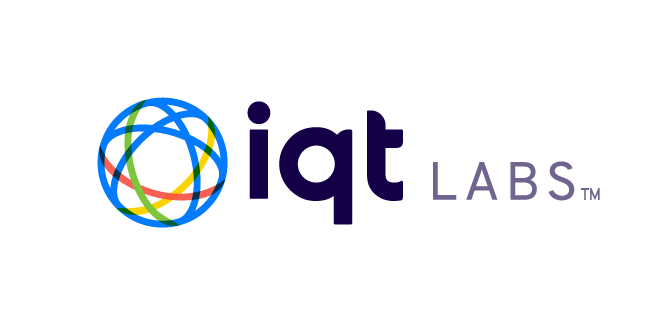

<a name="readme-top"></a>

[contributors-shield]: https://img.shields.io/github/contributors/IQTLabs/edgetech-audio-recorder.svg?style=for-the-badge
[contributors-url]: https://github.com/IQTLabs/edgetech-audio-recorder/graphs/contributors
[forks-shield]: https://img.shields.io/github/forks/IQTLabs/edgetech-audio-recorder.svg?style=for-the-badge
[forks-url]: https://github.com/IQTLabs/edgetech-audio-recorder/network/members
[stars-shield]: https://img.shields.io/github/stars/IQTLabs/edgetech-audio-recorder.svg?style=for-the-badge
[stars-url]: https://github.com/IQTLabs/edgetech-audio-recorder/stargazers
[issues-shield]: https://img.shields.io/github/issues/IQTLabs/edgetech-audio-recorder.svg?style=for-the-badge
[issues-url]: https://github.com/IQTLabs/edgetech-audio-recorder/issues
[license-shield]: https://img.shields.io/github/license/IQTLabs/edgetech-audio-recorder.svg?style=for-the-badge
[license-url]: https://github.com/IQTLabs/edgetech-audio-recorder/blob/master/LICENSE.txt
[product-screenshot]: images/screenshot.png

[Python]: https://img.shields.io/badge/python-000000?style=for-the-badge&logo=python
[Python-url]: https://www.python.org
[Poetry]: https://img.shields.io/badge/poetry-20232A?style=for-the-badge&logo=poetry
[Poetry-url]: https://python-poetry.org
[Docker]: https://img.shields.io/badge/docker-35495E?style=for-the-badge&logo=docker
[Docker-url]: https://www.docker.com

[![Contributors][contributors-shield]][contributors-url]
[![Forks][forks-shield]][forks-url]
[![Stargazers][stars-shield]][stars-url]
[![Issues][issues-shield]][issues-url]
[![MIT License][license-shield]][license-url]

<br />
<div align="center">
  <a href="https://iqtlabs.org/">
    
  </a>

<h1 align="center">AISonobuoy-Collector-PinePhone</h1>

  <p align="center">
    A PinePhone based maritime data collection system for the IQT Labs <a href="https://github.com/IQTLabs/AISonobuoy">AI Sonobuoy project</a>. Designed for continuous hydrophone audio, AIS, and other telemetry data collection for machine learning dataset creation. 
    <br/>
    <br/>
    <a href="https://github.com/IQTLabs/aisonobuoy-collector-pinephone/pulls">Make Contribution</a>
    ·
    <a href="https://github.com/IQTLabs/aisonobuoy-collector-pinephone/issues">Report Bug</a>
    ·
    <a href="https://github.com/IQTLabs/aisonobuoy-collector-pinephone/issues">Request Feature</a>
  </p>
</div>

## About

The PinePhone Collection System is designed to leverage readily accessible consumer electronics and open-source software in order to create a low-cost collection platform for maritime data. The primary functions of the PinePhone Collection System are hydrophone audio and AIS recording. The [software system](#software) utilizes a series of docker containers which extend the [EdgeTech platform](https://github.com/IQTLabs/edgetech-core/), which is a bus message architecture built on MQTT, to implement the collection functions. The [hardware and electronics](#hardware) are all readily available components which are plug-and-play and can be fitted into a dry box container with a few 3D printed parts.

|  |
|:--:|
| PinePhone Collector Field Kit|

## Getting Started

### Running

Use the following commands to clone the repo and run the containers. Docker compose and watchtower are used to download the docker images from [Docker Hub](https://hub.docker.com/u/iqtlabs) and run them.

```
git clone https://github.com/IQTLabs/aisonobuoy-collector-pinephone.git
cd aisonobuoy-collector-pinephone
docker-compose up
```

#### Prerequisites

Running this repo requires that you have the PinePhone configured with [Docker](https://www.docker.com/) installed. See [EdgeTech Device Setup](https://github.com/IQTLabs/edgetech-core/tree/main/device-setup-scripts).

### Development

The PinePhone Collector software system utilizes a series of docker containers which extend the [EdgeTech platform](https://github.com/IQTLabs/edgetech-core/), which is a bus message architecture built on MQTT, to implement the collection functions. The implementation of the EdgeTech module docker containers are linked in the diagram below.


The current required directory structure is below. You will need to clone the `edgetech` repos into your environment (they will be listed as submodules to this repo at the time of the first version tag).

```
aisonobuoy-collector-pinephone
|-- docker-compose.yaml
|-- edgetech-core
|-- edgetech-daisy
|-- edgetech-filesaver
|-- edgetech-c2c
|-- edgetech-pinephone-telemetry
|-- edgetech-couchdb-saver
|-- edgetech-database-sync
|-- edgetech-audio-recorder
|-- edgetech-http-uploader
|-- edgetech-s3-uploader
... IN PROGRESS
|-- edgetech-pinephone-gps
```

Refer to the [dev](https://github.com/IQTLabs/aisonobuoy-collector-pinephone/tree/dev) branch for development and contribution documentation.

## Hardware

### BOM

- [Pine Phone Pro](https://pine64.com/product/pinephone-pro-explorer-edition/)
- [Seahorse SE58 Drybox](http://www.seahorsecases.com/seahorse-se58-micro-case-81-x-41-x-43.html)
- [Aquarian H2a Hydrophone](https://www.aquarianaudio.com/h2a-hydrophone.html)
- [Voltaic V50 USB Battery Pack](https://voltaicsystems.com/v50/)
- [Voltaic 9 Watt Solar Panel](https://voltaicsystems.com/9-watt-18v-panel-etfe/)
- [Voltaic Solar Panel Bracket](https://voltaicsystems.com/large-bracket/)
- [Right angle Female 3.5x1.1mm - MicroUSB](https://voltaicsystems.com/f3511-microusb/)
- [dAISy 2+ dual-channel AIS Receiver](https://shop.wegmatt.com/products/daisy-2-dual-channel-ais-receiver-with-nmea-0183)
- [Anker 543 USB-C Hub](https://www.anker.com/products/a8365?variant=37438670667926)
- [PG 13.5 Cable Gland](https://voltaicsystems.com/PG135)

### 3D Printed STL Files

- [Lid Phone Mount]()
- [Drybox component mount insert]()

### Assembly Animation (Coming soon...)


## Roadmap

- TBA

See the [open issues](https://github.com/github_username/repo_name/issues) for a full list of proposed features (and known issues).

## Contributing

1. Fork the Project
2. Create your Feature Branch (`git checkout -b dev`)
3. Commit your Changes (`git commit -m 'adding some feature'`)
5. Push to the Branch (`git push origin dev`)
6. Open a Pull Request

See `CONTRIBUTING.md` for more information.

## License

Distributed under the [Apache 2.0](https://github.com/IQTLabs/edgetech-filesaver/blob/main/LICENSE). See `LICENSE.txt` for more information.

## Contact IQTLabs

  - Twtiter: [@iqtlabs](https://twitter.com/iqtlabs)
  - Email: info@iqtlabs.org

See our other projects: [https://github.com/IQTLabs/](https://github.com/IQTLabs/)

<p align="right">(<a href="#readme-top">back to top</a>)</p>
